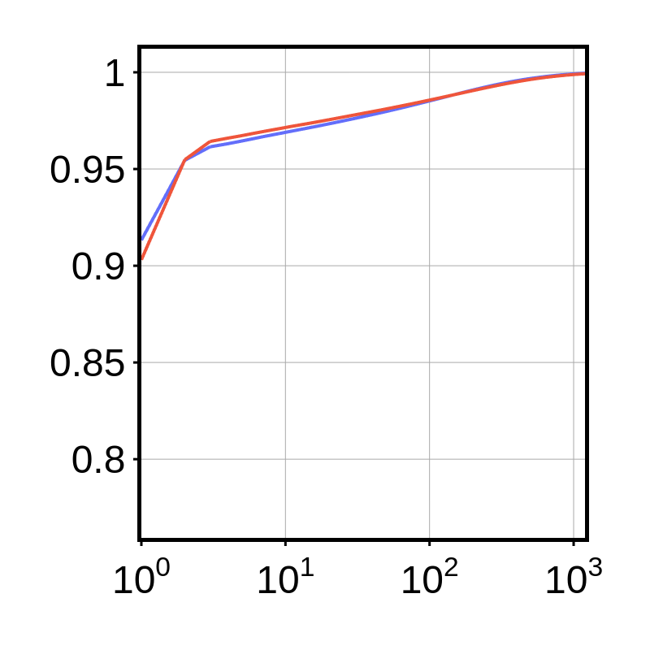
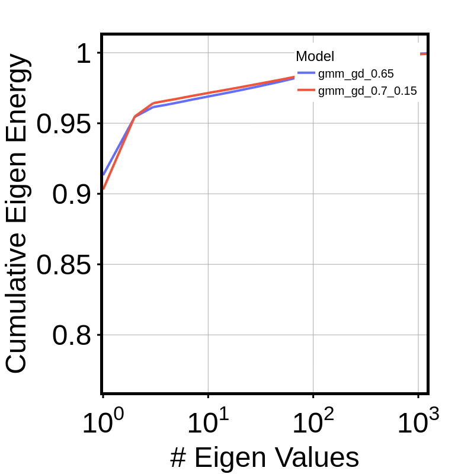
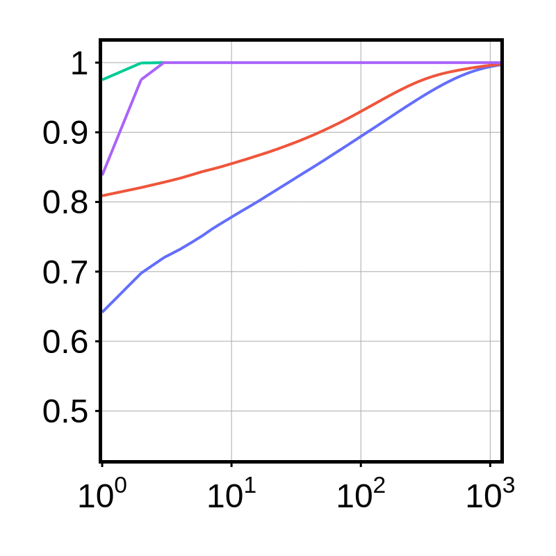
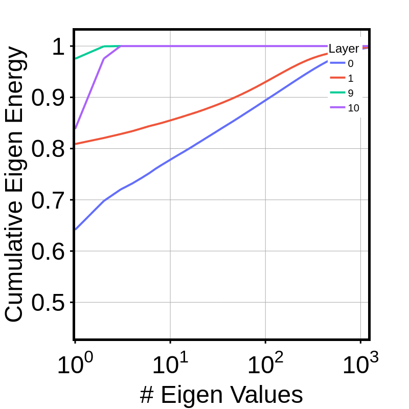
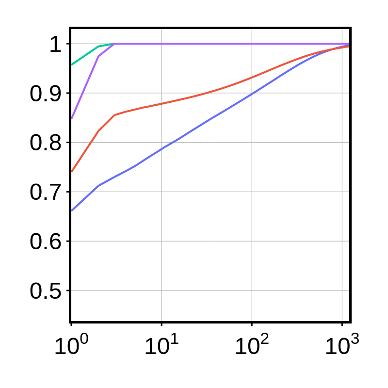
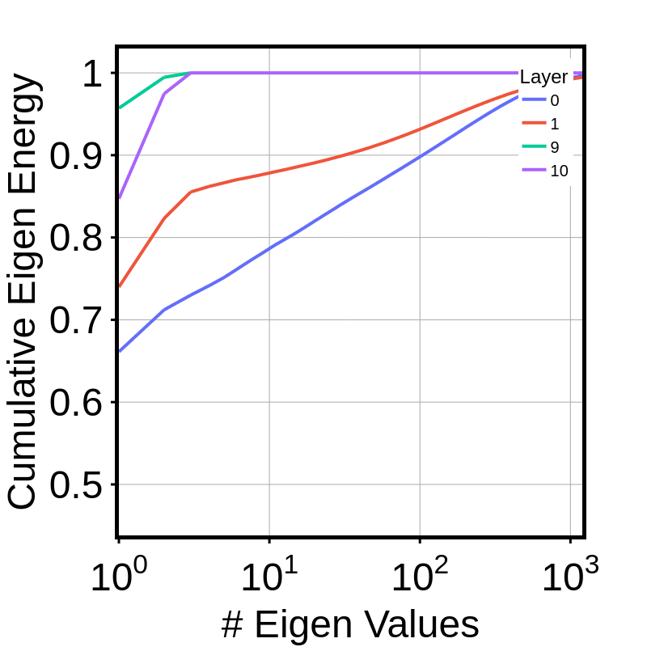
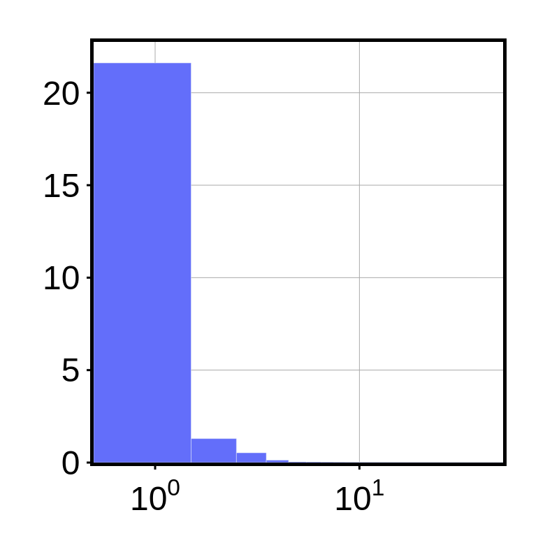
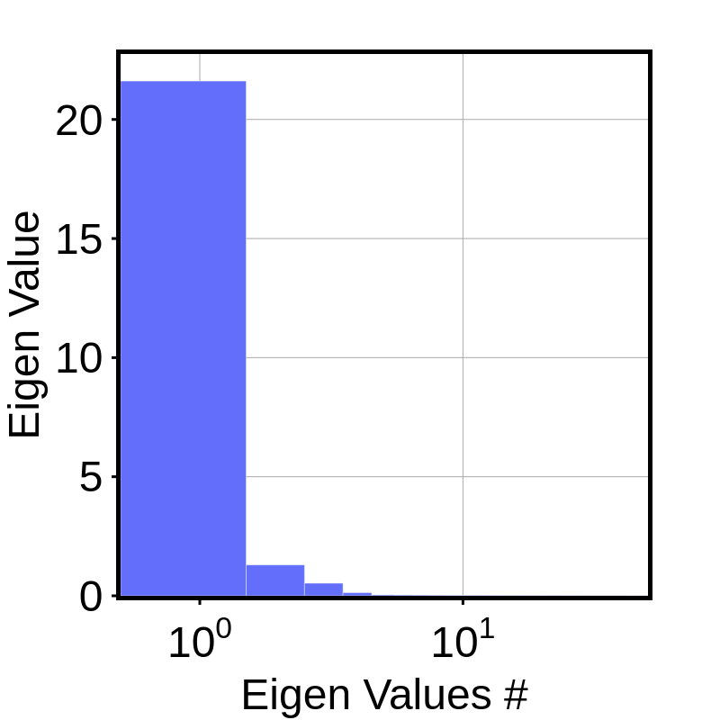
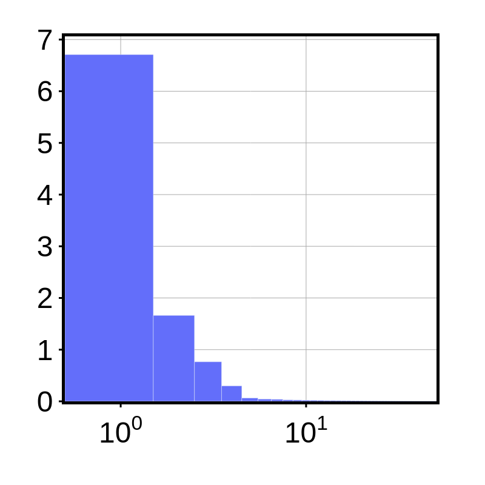
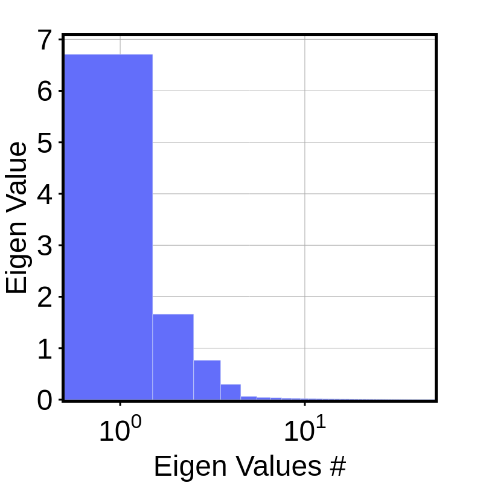

# Plots and stuff

## Plots deit eigen values

> deit_eigen_model

> deit_eigen_layer_gmm_gd_0.65

> deit_eigen_layer_gmm_gd_0.7_0.15

> deit_eigen_val_gmm_gd_0.65

> deit_eigen_val_gmm_gd_0.7_0.15

